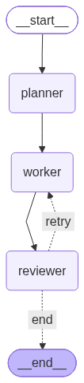

# Blog Agents: Multi-Agent Workflow with LangGraph

A planner, worker and reviewer agent that write a blog post together. The reviewer can send the draft back to the worker for fixes, up to 2 times.

## Graph



## State

`topic`, `outline`, `draft`, `feedback`, `retries`, `approved`

## How it works

1. **Planner** writes an outline for the topic.
2. **Worker** writes the draft from the outline (and from feedback on retries).
3. **Reviewer** approves or rejects with feedback.
4. Conditional edge: approved ends the run, rejected goes back to the worker while retries are under 2.

## What happens when the reviewer rejects twice

The loop stops at the retry cap and returns the last draft with `approved = False`. See [docs/failure_note.md](docs/failure_note.md).

## Run

```bash
pip install -r requirements.txt
cp .env.example .env   # add your GROQ_API_KEY
python main.py
```

Test the rejection path: `STRICT_REVIEWER=1 python main.py`

## Structure

```
main.py
draw_graph.py
src/  (state.py, nodes.py, router.py, graph.py)
docs/ (graph.png, failure_note.md)
```